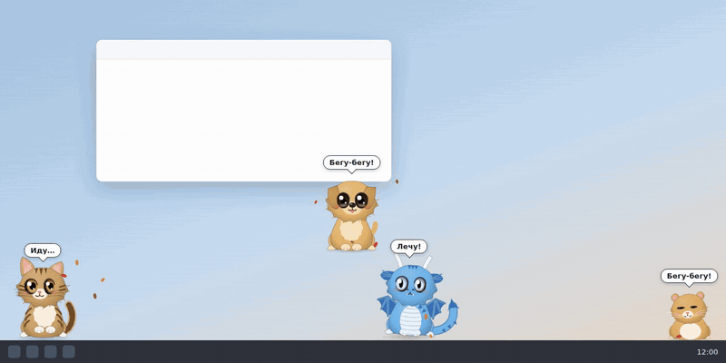

# Котик · Kotik

**Питомцы на рабочем столе Windows и macOS** · **Desktop pets for Windows and macOS**



[Скачать / Download](https://github.com/zloyBarsuk12/kotiki/releases/latest) · [Русский](#русский) · [English](#english)

## Русский

Котики, щенки, хомячки, попугаи, кролики, дракончики, домовята и свой питомец из картинки.
Гуляют по окнам и мониторам, спят, играют друг с другом, гоняют мышь, просят есть, болеют и
выздоравливают, получают бейджи.

### Установка

Скачайте установщик из [Releases](https://github.com/zloyBarsuk12/kotiki/releases/latest):

- **Windows** — `Kotik_<версия>_x64-setup.exe`. Установщик не подписан сертификатом, поэтому
  SmartScreen спросит: «Подробнее» → «Выполнить в любом случае».
- **macOS** — `.dmg` для Apple Silicon (`aarch64`) или Intel (`x64`). Приложение не заверено Apple:
  при первом запуске — «Системные настройки» → «Конфиденциальность и безопасность» → «Всё равно открыть».

Дальше Котик обновляется сам.

### Что умеет

- Внешность: окрасы, конструктор внешности, свой цвет, телосложение, пол, характер.
- Потомство: пара одного вида рожает малыша, который месяц растёт.
- Игрушки из трея: мячик, лазер, бабочка, пузыри, клубок, когтеточка, лежанка, миска.
- Хитрая мышь, прятки, трюки, танцы под музыку, реакции на звонок, погода, праздники.
- Уход: кормление, ласка, здоровье, болезни и лечение, задания дня.
- Календарь по ссылке `.ics` или CalDAV (Яндекс) — напоминания говорит питомец.
- Свой персонаж: PNG с прозрачным фоном превращается в питомца.

Всё хранится на компьютере. Приложение ходит в сеть только за погодой (open-meteo), календарём
(если вы его задали) и обновлениями (GitHub Releases).

## English

Cats, puppies, hamsters, parrots, rabbits, little dragons, house spirits — and your own pet made
from any picture. They walk across your windows and monitors, sleep, play with each other, chase
the mouse, ask for food, get sick and recover, and earn badges. The interface is in Russian.

### Install

Download the installer from [Releases](https://github.com/zloyBarsuk12/kotiki/releases/latest):

- **Windows** — `Kotik_<version>_x64-setup.exe`. The installer is not code-signed, so SmartScreen
  will warn you: “More info” → “Run anyway”.
- **macOS** — the `.dmg` for Apple Silicon (`aarch64`) or Intel (`x64`). The app is not notarized:
  on first launch go to System Settings → Privacy & Security → “Open Anyway”.

After that Kotik updates itself.

### Features

- Looks: coat colours, an appearance editor, custom colour, body type, sex, personality.
- Offspring: two pets of the same kind can have a baby that grows up over a month.
- Toys from the tray: ball, laser pointer, butterfly, bubbles, yarn, scratching post, bed, food bowl.
- A sneaky mouse, hide-and-seek, tricks, dancing to your music, call reactions, weather, holidays.
- Care: feeding, petting, health, sickness and a vet, daily quests.
- Calendar via an `.ics` link or CalDAV — your pet reads the reminders out loud.
- Custom character: any PNG with a transparent background becomes a pet.

Everything stays on your computer. The app only goes online for the weather (open-meteo), your
calendar (if you set one) and updates (GitHub Releases).

## Сборка · Building

Node 20 и Rust (stable) · Node 20 and Rust (stable):

```bash
npm install
npx tauri dev          # запуск · run
npx tauri build        # установщик под текущую систему · installer for this OS
```

Выпуски собирает GitHub Actions по тегу `v*` · Releases are built by GitHub Actions on `v*` tags
(`.github/workflows/release.yml`).

## Лицензия · License

MIT — [LICENSE](LICENSE).
